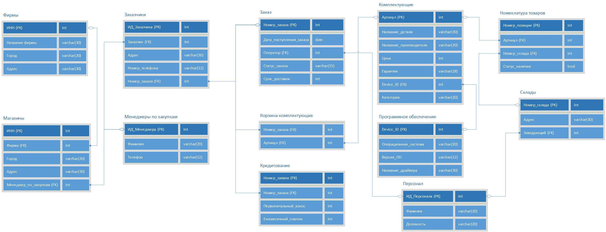

# :computer: Курсовой проект - ComputerUniverse 
Рабочее название проекта "ComputerUniverse".

CRUD SPA приложение для работы с базой данных PostgeSQL, разработанное с помощью Vue 3 и Laravel. База данных хранит и обрабатывает информацию для сети компьютерных магазинов. 

> **Note** Является частью курсового проекта 3 курса университета. 

## :books: Технологии использованы
* HTML, CSS, JavaScript
* Vue 3, Vuex
* Vuetify
* TypeScript
* PHP, Laravel

## :anchor: Быстрый переход

* [Особенности](#features)
* [Перед началом](#start)
* [Запуск сервера](#run)
* [Тестирование](#tests)
* [Скриншоты](#shots)

<a name="features"></a>

## Особенности
- Современный стэк технологий
- Адаптивный material веб-дизайн
- Покрытие тестами
- Ведение репозитория

<a name="start"></a>

## Перед началом
### Копирование репозитория
```bash
> git clone https://github.com/ErikMak/cu_termproject.git
```

### :hammer_and_wrench: Зависимости
Необходимо установить зависимости для:

1. Клиентской части приложения
2. Серверной части приложения

Запустите следующую команду в папке `computerUniverse`:
```bash
> npm install
```
Далее, запустите команду в папке `computerUniverseBackend`:
```bash
> composer install
```
Копирование файла конфигурации
```bash
> cp .env.example .env
```
Генерация ключей
```bash
> php artisan key:generate
> php artisan jwt:secret
```
Запуск миграций
```bash
> php artisan migrate
```
Заполнение базы данных
```bash
> php artisan db:seed
```

<a name="run"></a>

### :arrow_forward: Запуск сервера
Для этого перейдите в папку `computerUniverseBackend` и запустите команду:
```bash
> php artisan serve
```

Запуск клиентского сервера для разработки:
```bash
# open front-end folder
> cd computerUniverse
# serve with hot reload at localhost:8081
> npm run serve
```
<a name="tests"></a>
### :memo: Тестирование
Для запуска frontend тестов в папке `computerUniverse` запустите команду:
```bash
> npm run test:unit
```
Для запуска backend тестов в папке `computerUniverseBackend` запустите команду:
```bash
> php artisan test
```
<a name="shots"></a>
### :camera: Скриншоты
_IDEF1x модель_

_Схема таблиц базы данных_

_Дизайн в Figma_
<div style="display: flex">


</div>